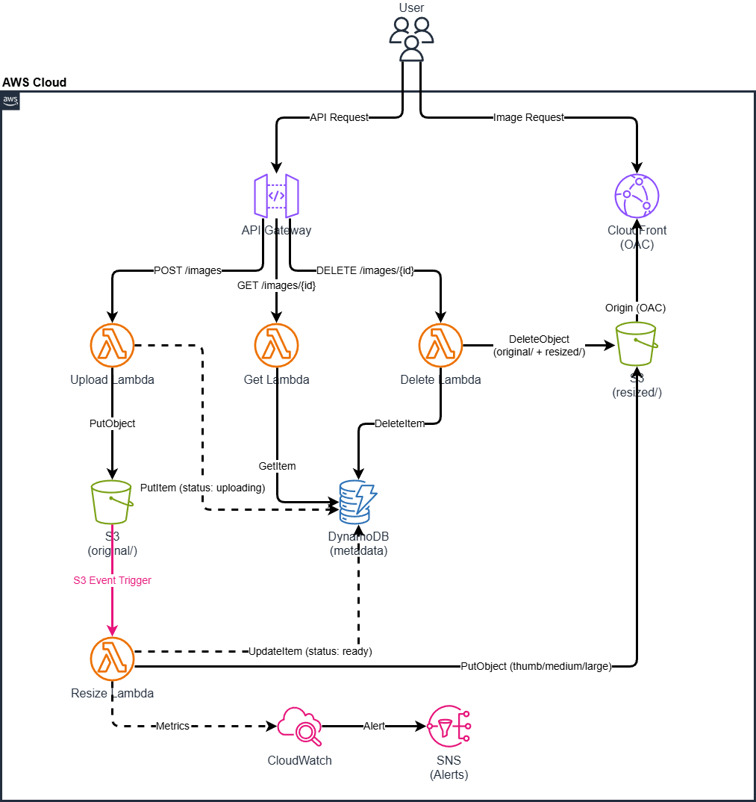

# アーキテクチャ設計書 — Serverless Image Resize API

## 1. アーキテクチャ概要

本システムは AWS サーバーレスサービスを中心に構成し、固定費ゼロ・従量課金のみで運用可能な画像処理 API を実現する。

## 2. サービス選定

### Compute: AWS Lambda

| 比較項目 | Lambda | ECS Fargate | EC2 |
|----------|--------|-------------|-----|
| 運用負荷 | ◎ なし | ○ コンテナ管理 | △ OS管理 |
| コスト（低トラフィック） | ◎ 無料枠内 | △ 最低 ~$15/月 | △ ~$5/月 |
| スケーリング | ◎ 自動 | ○ 自動（設定要） | △ 手動/ASG |
| コールドスタート | △ あり（~1秒） | ○ なし | ◎ なし |
| 学習コスト | ○ 中 | ○ 中 | ◎ 低 |

**選定理由**: 画像リサイズはイベント駆動の断続的処理であり、常時稼働が不要。無料枠で月100万リクエスト処理可能で、個人利用のコスト要件に最適。

→ 詳細: [ADR-001](adr/001-serverless-architecture.md)

### Database: Amazon DynamoDB

| 比較項目 | DynamoDB | RDS (PostgreSQL) | S3 メタデータ |
|----------|----------|-------------------|---------------|
| レイテンシ | ◎ 1桁ms | ○ ~10ms | △ ~50ms |
| 運用負荷 | ◎ フルマネージド | △ パッチ適用等 | ◎ なし |
| コスト（低トラフィック） | ◎ 無料枠 25GB | △ ~$15/月 | ◎ 無料枠内 |
| クエリ柔軟性 | △ 制限あり | ◎ SQL | × なし |
| VPC 要否 | ◎ 不要 | × 必要 | ◎ 不要 |

**選定理由**: メタデータは Key-Value アクセスが中心で複雑なクエリ不要。DynamoDB は VPC 不要で Lambda との相性が良く、無料枠も十分。RDS は VPC + NAT Gateway が必要となり、固定費が発生するため不採用。

→ 詳細: [ADR-002](adr/002-dynamodb-over-rds.md)

### IaC: Terraform

| 比較項目 | Terraform | CloudFormation | CDK |
|----------|-----------|----------------|-----|
| マルチクラウド | ◎ 対応 | × AWS のみ | △ AWS中心 |
| 求人市場 | ◎ 高需要 | ○ 中 | ○ 増加中 |
| State 管理 | △ 別途必要 | ◎ AWS管理 | ◎ AWS管理 |
| 学習コスト | ○ HCL学習 | ○ YAML/JSON | △ プログラミング |
| エコシステム | ◎ 豊富 | ○ | ○ |

**選定理由**: 転職市場での需要が最も高く、ポートフォリオとしてのアピール力が大きい。マルチクラウド対応のスキルは汎用性が高い。

→ 詳細: [ADR-003](adr/003-terraform-iac.md)

## 3. データフロー

### アップロードフロー

1. Client → API Gateway: `POST /images` (画像バイナリ)
2. API Gateway → Upload Lambda: リクエスト転送
3. Upload Lambda → S3: `original/{image_id}.{ext}` に保存
4. Upload Lambda → DynamoDB: メタデータ初期登録（status: `uploading`）
5. Upload Lambda → Client: 画像 ID を返却（201 Created）
6. S3 → Resize Lambda: S3 Event Notification でトリガー
7. Resize Lambda → S3: 3サイズのリサイズ画像を `resized/` に保存
8. Resize Lambda → DynamoDB: メタデータ更新（status: `ready`, URL追加）

### 取得フロー

1. Client → API Gateway: `GET /images/{id}`
2. Get Lambda → DynamoDB: メタデータ取得
3. Get Lambda → Client: CloudFront URL を含むメタデータを返却

### 配信フロー

1. End User → CloudFront: 画像 URL にアクセス
2. CloudFront → S3 (OAC): キャッシュミス時のみ S3 から取得
3. CloudFront → End User: キャッシュ済み画像を配信

## 4. セキュリティ設計

### IAM ロール分離

各 Lambda 関数に専用の IAM ロールを割り当て、最小権限の原則を徹底する。

| Lambda | S3 権限 | DynamoDB 権限 |
|--------|---------|---------------|
| Upload | `s3:PutObject` (original/*) | `dynamodb:PutItem` |
| Resize | `s3:GetObject` (original/*), `s3:PutObject` (resized/*) | `dynamodb:UpdateItem` |
| Get | なし | `dynamodb:GetItem` |
| Delete | `s3:DeleteObject` (original/*, resized/*) | `dynamodb:DeleteItem` |

### S3 アクセス制御

- パブリックアクセス: 全ブロック
- CloudFront からのアクセス: OAC (Origin Access Control) で制限
- Lambda からのアクセス: IAM ロールで制御

### API 認証

- API Gateway Usage Plan + API Key
- レート制限: 100 req/sec, バースト 200
- 月間クォータ: 10,000 リクエスト

## 5. モニタリング設計

| メトリクス | アラーム閾値 | 通知先 |
|-----------|-------------|--------|
| Lambda エラー率 | > 5% (5分間) | CloudWatch → SNS → Email |
| Lambda 実行時間 | > 10秒 | CloudWatch → SNS → Email |
| API Gateway 5xx | > 10回/5分 | CloudWatch → SNS → Email |
| S3 バケットサイズ | > 4.5GB | CloudWatch → SNS → Email |
| 月額コスト | > $5 | AWS Budgets → Email |

## 6. タグ設計

全リソースに以下のタグを付与する。

| Tag Key | Value | 用途 |
|---------|-------|------|
| Project | serverless-image-resize | リソース識別 |
| Environment | prod | 環境識別 |
| ManagedBy | terraform | 管理方法識別 |
| Owner | your-name | 責任者識別 |
